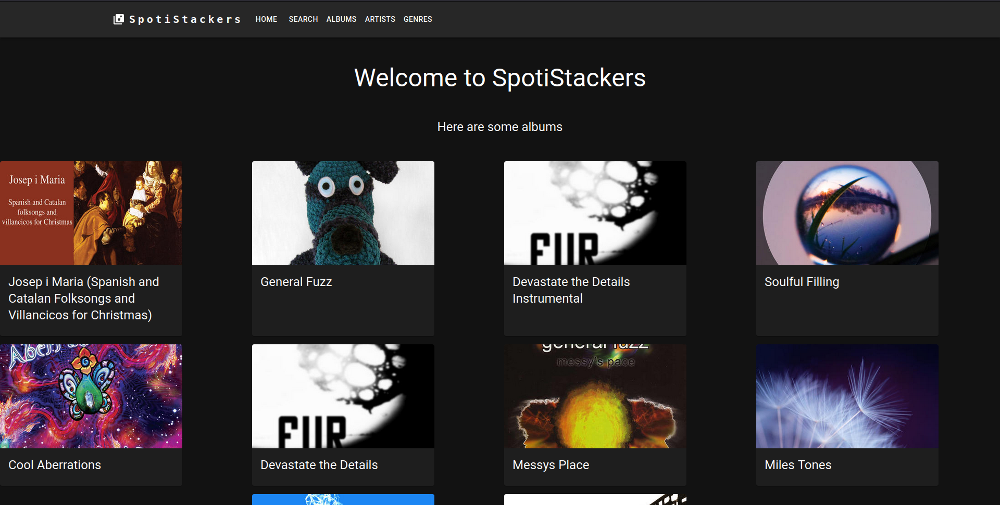
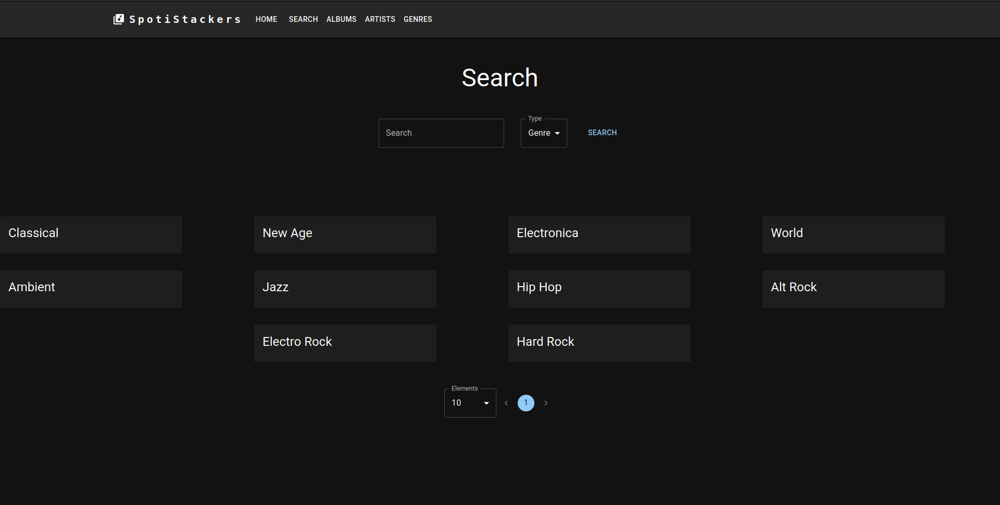
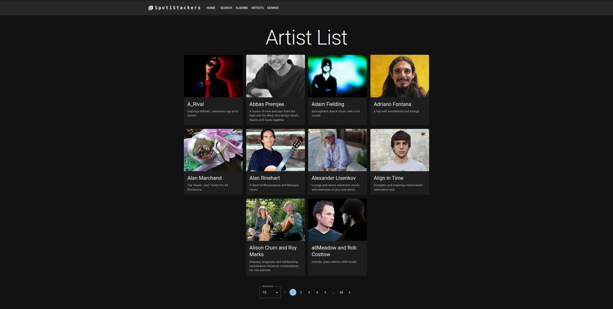
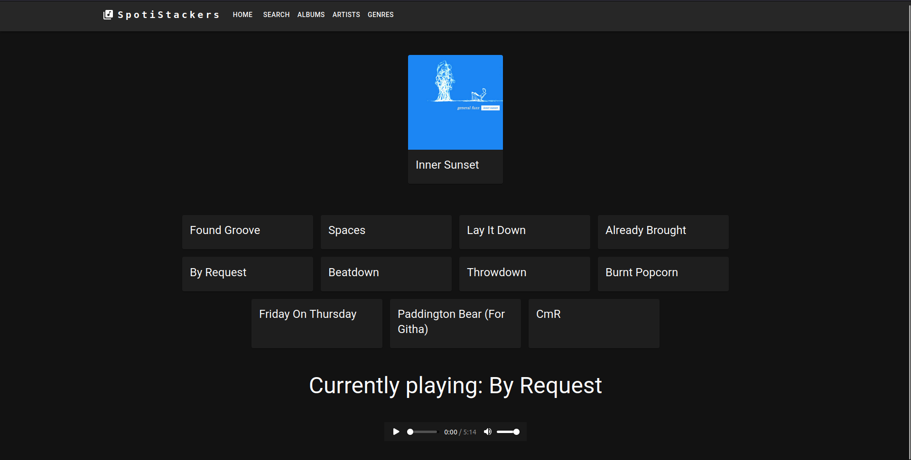

# epitech-my-spotify

## FR

Le but de ce projet était de créer un équivalent à spotify en front seulement en utilisant une api fournie par Epitech

Durée : 2 jours

Technologies utilisées : React.JS, Node.JS

## EN

The goal of this project is to create a spotify like in front only using an api provided by Epitech

Duration : 2 days

Technologies used : React.JS, Node.JS

## Screenshots

### Home / Accueil

### Search / Recherche

### Artist List / Liste des artistes

### Album tracks / Chansons d'un album

